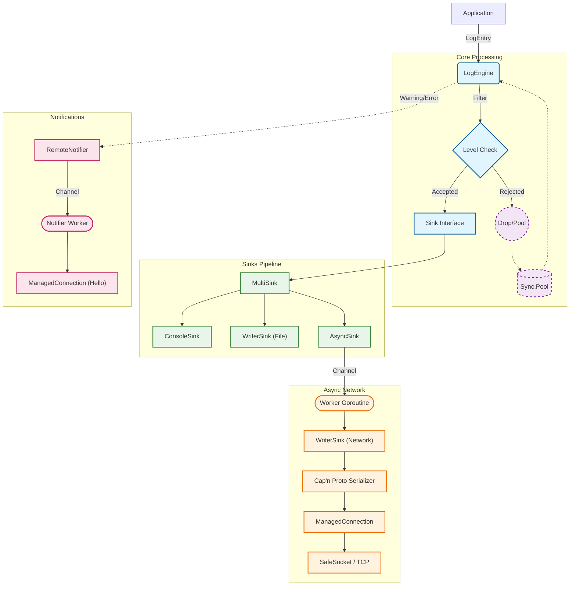

# Architecture

This document describes the internal design of the Flexible Logger.

## Data Flow

## Key Components

### 1. LogEngine (Core)
The central entry point. It handles:
*   **Pooling**: Retrieves `LogEntry` objects from a `sync.Pool`.
*   **Filtering**: Checks log levels (Debug, Info, etc.) before processing.
*   **Routing**: Passes valid entries to the configured `Sink` and `Notifier`.

### 2. Sinks (`src/sink`)
Sinks form a pipeline to handle log data.
*   **`WriterSink`**: Wraps an `io.Writer`. Serializes the entry (e.g., to Cap'n Proto) and writes bytes.
*   **`AsyncSink`**: Decouples the application from IO. Uses a buffered channel. If the buffer is full, it drops logs to prevent blocking.
*   **`MultiSink`**: Fan-out pattern. Sends one log entry to multiple destinations (e.g., File + Network).
*   **Memory Management**: Sinks accept ownership of a `LogEntry` and are responsible for calling `Release()` to return it to the pool.

### 3. Network Manager (`src/network_manager`)
Handles robust network communication.
*   **`NetworkManager`**: Factory for creating connections.
*   **`ManagedConnection`**: A wrapper around the raw socket. It intercepts `Write()` calls; if the underlying connection is broken, it automatically attempts to reconnect (blocking or async depending on config) and retries the write.
*   **`EstablishConnection`**: Centralized logic for IP/Port resolution and socket creation.

### 4. Remote Notifier (`src/notifier`)
A separate subsystem for high-priority alerts (Warnings/Errors).
*   **Independent Channel**: Does not block the main log stream.
*   **Protocol**: Uses a dedicated lightweight protocol (`tcp-hello` profile) to send alerts to a monitoring server.
*   **Resilience**: Uses `ManagedConnection` for auto-reconnection.
