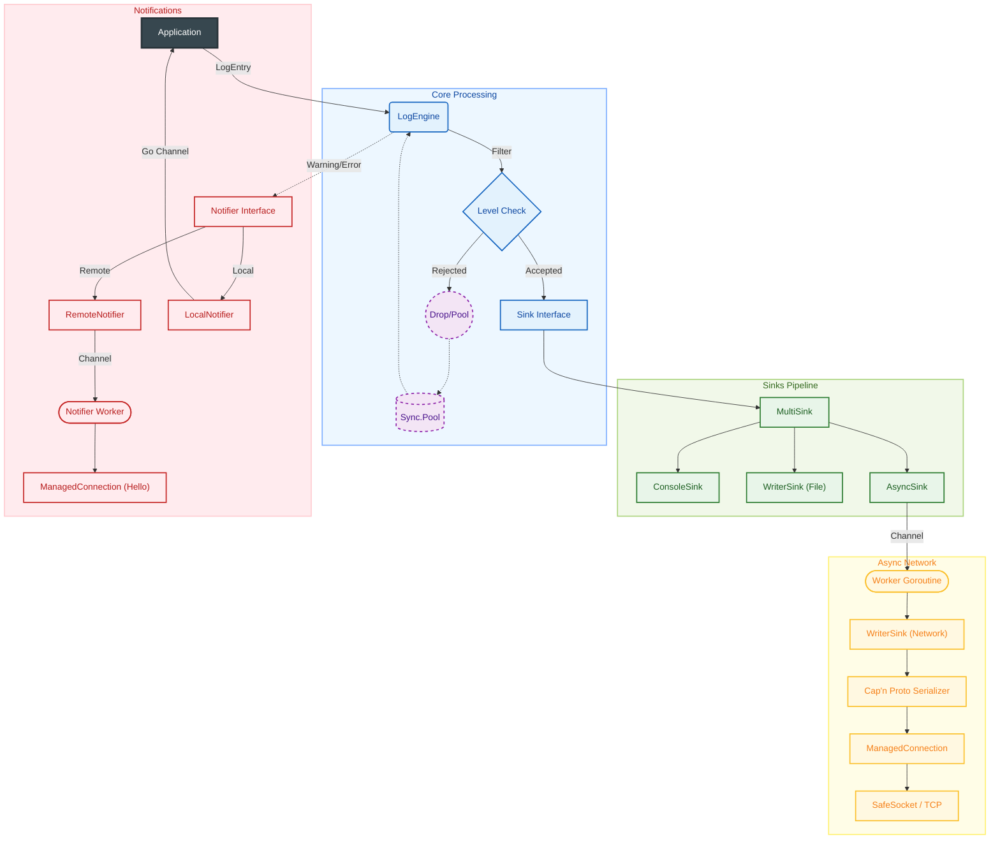

# Architecture Overview

This document describes the high-level design, data flows, and key internal components of the Flexible Logger.

## Data Flow

## Key Components

### 1. LogEngine (Core)
The central entry point for all logging calls:
*   **Printf-style API**: Methods accept `(format string, args ...any)`, formatting the message internally via Go's standard formatting library.
*   **Pooling**: Leverages a robust `sync.Pool` to reuse `LogEntry` structures, avoiding unnecessary allocations on hot paths.
*   **Filtering**: Checks active log levels (e.g., Debug, Info, etc.) before proceeding with deeper formatting or caller discovery.
*   **Sampling**: Employs probabilistic dropping strategies on high-throughput non-critical paths to protect CPU/memory resources without losing important state.
*   **Metadata Enrichment**: Automatically tags logs with standard context including `ProcessID`, `ProcessName`, and `Hostname`.
*   **Smart Caller Discovery**: Uses `runtime.Caller` selectively based on log level or profile settings to locate code source file/line numbers efficiently.
*   **Routing**: Handles internal dispatching of entries to the correct `Sink` pipeline and optional `Notifier` channels.

### 2. Sinks Pipeline
All logs flow from the `LogEngine` through standard sink pipelines:
*   **`WriterSink`**: Wraps standard writers (like Console or Files). Serializes logs (e.g., into Cap'n Proto bytes) and executes the write.
*   **`AsyncSink`**: Decouples active execution threads from blocking I/O using highly-optimized buffered channels. Supports smart dropping behaviors if capacity thresholds are exceeded under high pressure.
*   **`MultiSink`**: Supports fan-out operations, distributing log payloads synchronously/asynchronously across multiple underlying sinks (e.g., local console logging combined with remote network logging).

### 3. Connection Management (Outsourced)
In alignment with modern microservice standards, the logger delegates underlying TCP socket and lifecycle management:
*   **Centralized Integration**: Leverages the `conn_manager.NetworkManager` from the `microservice-toolbox`.
*   **ManagedConnection**: Automatically handles standard backoff profiles, retry jittering, connection state bookkeeping, and standard handshakes.

### 4. Notifiers Subsystem
A specialized pathway for high-importance telemetry (such as Warnings or Critical Errors):
*   **Decoupled Path**: Avoids the standard sink queues to guarantee low latency.
*   **`RemoteNotifier`**: Employs a dedicated TCP profile (`tcp-hello`) for sending alerts to target monitor processes, serializing payloads using standard Cap'n Proto schemas.
*   **`LocalNotifier`**: Pipes alerts to Go channels in-process, allowing local applications to react dynamically to error states.
