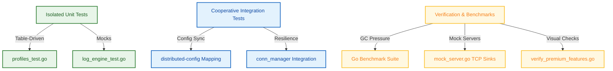

# Testing Playbook

This playbook outlines the testing architecture, validation strategies, mock infrastructure, and benchmarking protocols for the Flexible Logger library.

---

## Test Categories

To ensure extreme reliability and memory-safety, the test suite covers five core categories:

1.  **Engine Logic**: Validates log level filtering, metadata enrichment pipelines, and internal pool retrieval mechanics.
2.  **Sinks & Notifiers**: Assures accurate packet routing to OS stdout, local files, and remote network destinations.
3.  **Serialization**: Guarantees zero-allocation, high-fidelity mapping of log structures to Cap'n Proto binary and JSON structures.
4.  **Network Resilience**: Verifies connection strategies, backoff timers, and profile-specific retry presets (Standard, Critical, Performance).
5.  **Concurrency & Race Conditions**: Stress-tests non-blocking asynchronous channels and synchronization patterns under severe thread contention.

---

## Three-Tier Testing Strategy



### 1. Unit Testing (Isolated)
Unit tests isolate logical packages and components, avoiding true I/O wait times:
*   **Table-Driven Testing**: We leverage standard Go table-driven patterns to boot and verify various configuration blocks inside one continuous sweep.
*   **Engine & Profile Verification**: [profiles_test.go](src/profiles/profiles_test.go) and [log_engine_test.go](src/engine/log_engine_test.go) verify standard profiles, custom logging methods, and level filtering mechanisms.
*   **In-Process Reactions**: Tests like `TestNotifLogger_LocalQueue` verify that errors are correctly piped to internal Go notification queues without leaking memory.

### 2. Integration Testing (Cooperative)
Integration tests verify proper coordination between the logger and the wider microservices ecosystem:
*   **Ecosystem Integrations**: Assures standard key mapping and configuration syncing via the `distributed-config` library.
*   **Resilience and Backoffs**: Tests how logger sinks react to connection closures, network interruptions, and recovery sweeps driven by the `microservice-toolbox` networking manager.

### 3. Verification & Benchmarking
*   **Zero-Allocation Benchmarking**: Enforces the zero-allocation goal using standard Go benchmark parameters.
*   **Ecosystem Mocking**: Employs in-memory, thread-safe mock servers to simulate heavy backpressure and connectivity drops.

---

## Specialized Test Infrastructure

### 1. Log Server Connectivity Tool
*   **Path**: `cmd/test-log-server/main.go`
*   **Role**:
    *   Acts as a standalone networking validation client to inspect connectivity against real active log servers at standard addresses (`127.0.0.2:9020`).
    *   Accompanied by a complete `connection_test.go` suite to measure integration behavior and throughput under varying network topologies.

### 2. Mock Infrastructure
*   **Path**: `src/test_utils/mock_server.go`
*   **Role**:
    *   **`StartMockServer`**: Spins up lightweight, local TCP listeners that discard incoming frames immediately.
    *   Provides thread-safe instrumentation to assert payload delivery, preventing "connection refused" blockages in closed pipelines (like local sandboxes or remote GitHub Actions runners) without requiring external dependencies.

---

## Executing the Verification Playbook

Run the following commands from the project root to trigger the local verification playbook:

### 1. Standard Unit Testing
To run standard unit tests locally:
```bash
make test
```

### 2. Concurrency and Race Auditing
To execute tests with Go's race detector active (enforced on all asynchronous writing paths):
```bash
go test -race ./...
```
*Note: Thread safety in all test utilities and mock objects (`MockSink`, `MockNotifier`) is enforced using standard Go `sync.Mutex` locks.*

### 3. Running High-Throughput Benchmarks
To simulate severe application logging volume:
```bash
go run cmd/test/main.go
```
This routine:
1.  Spins up two independent thread-safe mock listeners (for Logs and Notifications).
2.  Bootstraps a local `HighPerfLogger` profile targeting these sockets.
3.  Transmits exactly **1,000,000** log entries and calculates throughput metrics (logs/second).

### 4. Visual Verification of Premium Features
To manually examine structured JSON, smart sampling, and compliance blocking:
```bash
go run scratch/verify_premium_features.go
```
This utility exercises the `CloudNative` profile (emitting pure JSON lines to standard out) and asserts that standard probabilistic sampling effectively scales log volume without dropping crucial Error levels.

---

## Continuous Integration Quality Gates

The `flexible-logger` CI pipeline (`.github/workflows/ci-cd.yml`) implements three automated quality checks on every push:
1.  **Code Sanitization**: Runs the ecosystem standard `golangci-lint` to enforce style guidelines.
2.  **Strict Verification Suite**: Executes all unit tests in verbose mode with the race detector enabled (`-v -race`).
3.  **Benchmark Integrity**: Runs the 1,000,000-message throughput test to verify that memory pooling objectives are maintained under heavy concurrent pressure.
